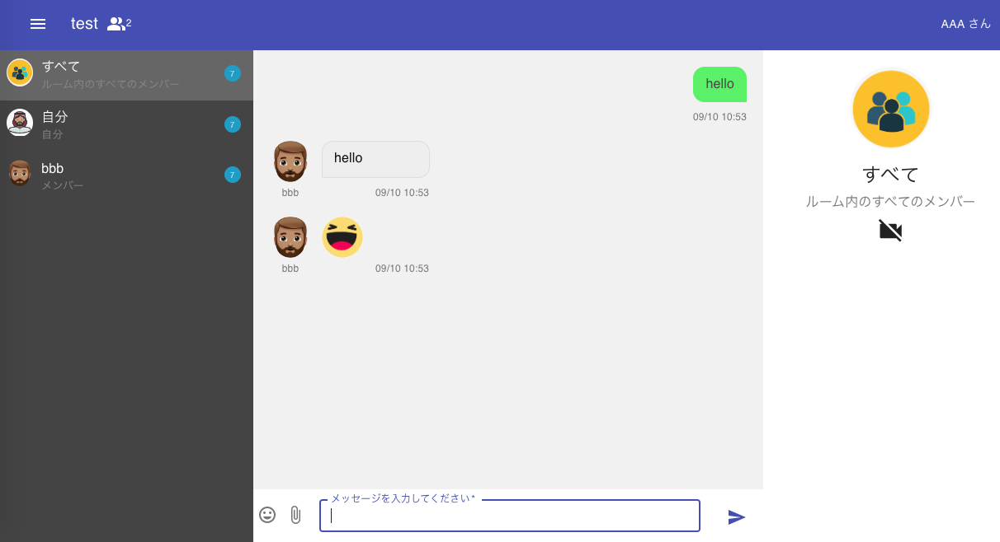

🌙 react-video-chat
====

[](https://circleci.com/gh/isystk/react-video-chat/tree/master)


## 📗 プロジェクトの概要

React.js(Next.js)で作成したビデオ&チャットアプリケーションです。<br/>
チャット機能は、AWS Lambda の WebSocket機能を利用しています。<br/>
ビデオ通話には、AWS Kinesis Video Streamを利用しています。

## 🌐 Demo

https://react-video-chat-isystk.vercel.app




## 📦 ディレクトリ構造

```
.
├── LICENSE
├── README.md
├── app.png
├── aws-sam
│   ├── layers
│   ├── onconnect
│   ├── ondisconnect
│   ├── samconfig.toml
│   ├── sendmessage
│   └── template.yaml
├── jest.config.js
├── next-env.d.ts
├── next.config.js
├── node_modules
├── public
│   ├── apple-touch-icon.png
│   ├── favicon.ico
│   ├── images
│   ├── manifest.json
│   ├── ogp-image.png
│   └── sounds
├── src
│   ├── @types
│   ├── API.ts（amplify）
│   ├── assets
│   ├── aws-exports.js（amplify）
│   ├── components
│   ├── constants
│   ├── graphql（amplify）
│   ├── models（amplify）
│   ├── pages
│   ├── services
│   ├── stores
│   └── utils
├── tsconfig.jest.json
├── tsconfig.json
└── yarn.lock
```

## 🖊️ 環境構築

IAM ユーザーを用意する
```
ユーザ名：「lambda-user」
アクセス権限：
「AmazonKinesisVideoStreamsFullAccess」
「AdministratorAccess」
```

SAMコマンドをインストールする
```
$ pip install aws-sam-cli
```

AWSに、DynamoDB、Lambda&APIGatewayをCFnで構築する
```
$ WebSocket - AWS の API Gateway と Lambda でルーム機能付きのchatを作る時の仕様を考える
$ sam build
$ sam deploy --config-env stg
```
[{"M":{"icon":{"S":"avatar"},"connectionId":{"S":"Wxs75dHHNjMCElA="},"username":{"S":"taro"}}},{"M":{"icon":{"S":"avatar"},"connectionId":{"S":"Wxs9XdooNjMCIcA="},"username":{"S":"taro"}}}]
WebSocketの動作を確認する
```
$ wscat -c wss:///xxxxxx.execute-api.ap-northeast-1.amazonaws.com/Prod?roomId=test
Connected (press CTRL+C to quit)
< { "action": "sendmessage", "data": {"type": "test", "value": "hello world" }}
```

AWSから、DynamoDB、Lambda&APIGatewayを削除する
```
$ cd aws-sam
$ sam delete --stack-name reactVideoChat
```

Amplify の環境を構築する
```
$ amplify pull --appId d1gaaytviiyq79 --envName dev
```

## 💬 使い方

```
$ cp .env.example .env
$ yarn
$ yarn dev
```

## 🎨 参考

| プロジェクト| 概要|
| :---------------------------------------| :-------------------------------|
| [Material Icons](https://v4.mui.com/components/material-icons/)| Material Icons |
| [Amazon Kinesis Video Streams WebRTC を動かしてみた](https://qiita.com/massie_g/items/b6d3513d06a28ba89677)| Amazon Kinesis Video Streams WebRTC を動かしてみた |
| [Amazon Kinesis Video Streams WebRTC で無理やり複数人のビデオチャットを作る](https://qiita.com/massie_g/items/4cdf475ab623757a2630)| Amazon Kinesis Video Streams WebRTC で無理やり複数人のビデオチャットを作る |
| [WebSocket - AWS の API Gateway と Lambda でルーム機能付きのchatを作る時の仕様を考える](https://qiita.com/anfangd/items/ebcd77173341b10b3684)| WebSocket - AWS の API Gateway と Lambda でルーム機能付きのchatを作る時の仕様を考える |


## 🎫 Licence

[MIT](https://github.com/isystk/react-video-chat/blob/master/LICENSE)

## 👀 Author

[isystk](https://github.com/isystk)

